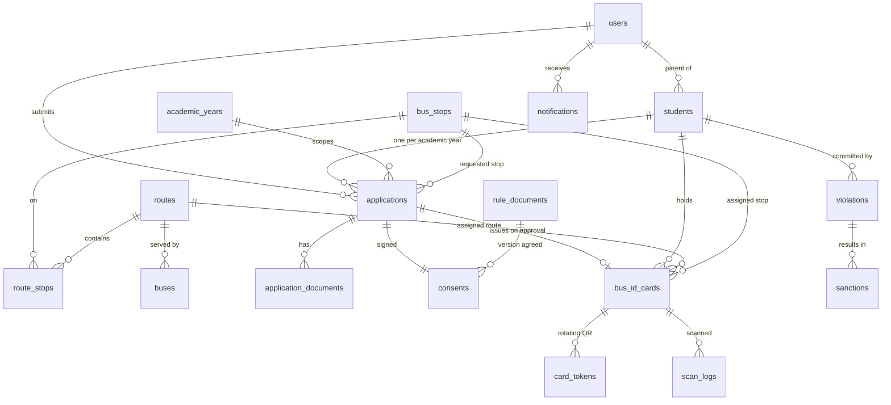
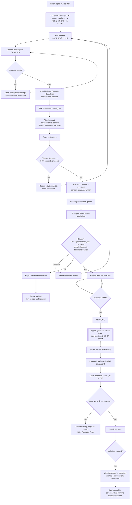

# YPJ School Bus Management Application — System Specification

**Client:** YPJ Kuala Kencana (Yayasan Pendidikan Jayawijaya), Timika — Papua Tengah
**Document owner:** System Analyst / Product Manager
**Version:** 1.0 — replaces the 2024/2025 Microsoft Forms + Excel process
**Baseline data analysed:** `Form Bis.pdf` (10-question MS Form) and `Form Pengajuan Pengguna Bis Sekolah YPJ Kuala Kencana(1-223).xlsx` (223 submissions)

---

## 1. Why we are replacing the current process

The 2024/2025 intake ran on a Microsoft Form feeding one flat Excel sheet. What the 223-row export tells us:

| Finding in the export | Consequence | How the app fixes it |
|---|---|---|
| `Perusahaan/Inst` has **87 distinct spellings** for ~6 real employers (`PTFI`, `PT FI`, `PT.FI`, `PTFi`, `Freeport indonesia`, …) | Eligibility against the PTFI-sponsored-registration policy (HR.EDUC.01) cannot be checked or reported on | Free-text employer field is replaced by a fixed **Kategori Orang Tua** selector: PT Freeport Indonesia, PTFI Privatisasi, PTFI Contractor, Other (Bukan TNI/Polri & Government Official) — a closed HR-defined list with nothing left to normalise |
| `Nomor ID` (parent employee ID) is optional and sometimes blank | No reliable link between a student and a sponsoring employee | Required + validated, and de-duplicated per parent account |
| Duplicate submissions (rows 2 and 3 are the same child, submitted twice with different emails) | Inflated demand figures; seat planning is wrong | Unique constraint on (student, academic year) + duplicate detection at submit time |
| "1 form 1 siswa" is a written instruction, not a rule | Siblings submitted on one form, or one child submitted 3× | One application record **per student**, siblings linked to the same parent account |
| `Titik Penjemputan` is a radio list of 19 stops with **no capacity awareness** — TPS#17 drew 47 requests, TPS#3 45, TPS#1 33, while TPS#5/#11/#18/#19 drew 1 each | Overloaded and near-empty stops; no data to re-plan routes | Stops carry a `seat_capacity`; the admin queue shows live load per stop/route and blocks over-allocation |
| No photo is collected | Bus attendants cannot verify who is boarding | Photo is mandatory and is printed on the digital card |
| "Signature" is a single checkbox: *"Saya telah membaca dengan seksama dan setuju dengan ketentuan ini"* | Weak legal evidence for privilege revocation | Drawn e-signature + versioned rules snapshot + timestamp/IP/device audit record |
| Approval and card issuance are manual/offline | Slow, inconsistent, no audit trail | Approval triggers **automatic** ID-card + QR generation |
| Grades observed: Toddler(1), TK A(1), TK B(2), Kelas 1(53), 2(18), 3(42), 4(27), 5(31), 6(32), 7(4), 8(5), 9(7) | Demand is overwhelmingly primary-level; a bus plan must weight SD | Grade is an enum, and demand-by-grade is a first-class report |

**Design principle carried over from the old form:** everything that was on paper stays — the app must not ask parents for *more* than the MS Form did, only for the photo and the drawn signature.

---

## 2. Scope

### In scope (v1)
1. Parent self-service registration, per-student application, mandatory rules consent + e-signature.
2. Transport Team web portal: verification queue, eligibility & capacity checks, approve/reject with reason.
3. Automatic digital Bus ID Card with QR, viewable and downloadable by the parent.
4. Attendant/driver scanning of the QR at boarding, with a violation-reporting entry point.
5. Suspension / revocation of transit privileges, enforced at scan time.

### Out of scope (v1, noted for roadmap)
GPS live tracking, fare/billing (service is free per the rules document), automated parent push on every boarding, route optimisation engine.

---

## 3. Roles & permissions

| Role | Key | Capabilities |
|---|---|---|
| Parent / Guardian | `parent` | Own profile, own students, create/submit applications, view own consent record, view/download own children's cards, see violation notices |
| Transport Team | `transport_admin` | Full queue, verify, approve/reject, allocate route+stop+bus, issue/suspend/revoke cards, manage stops/routes/buses, reports |
| Bus Attendant / Driver | `attendant` | Scan QR, see manifest for their trip, report violations. No access to parent contact data beyond emergency phone |
| School Admin (read) | `school_staff` | Read-only dashboards & manifests |
| Super Admin | `super_admin` | User & role management, rules-document publishing, audit log |

Support contacts from the rules sheet are seeded as the first `transport_admin` accounts: **Yoce Pallo** (ypallo@fmi.com, 0823 4444 75224) and **Natalius Marani** (nmarani@fmi.com, 0813 4433 7315).

---

## 4. Database schema

### 4.1 Entity-relationship overview



### 4.2 Table catalogue

| Table | Purpose | Notable columns / rules |
|---|---|---|
| `academic_years` | Scopes an intake ("2026/2027") | `is_current` — derived from the date at boot, so cards are never issued already expired |
| `users` | Parents, admins, attendants — one table, `role` column | `role`, `name`, `email`, `password_hash`, `phone_primary`, `phone_alternate` + `phone_alternate_owner` (the old form allowed "two numbers with an owner note" in one field), `employee_id`, `parent_category` (fixed HR-defined key, see §1), `department`, `home_address` |
| `students` | The child | `full_name`, `grade` (`toddler`…`kelas_9` — YPJ Kuala Kencana's actual range), `nis`, `photo_file`, `date_of_birth`. Unique per parent on (name, grade), so the same child cannot be entered twice |
| `bus_stops` | The 19 TPS from the form, verbatim codes | `code` (`TPS#17`), `name`, `area` (`KK`/`SP2`/`SP3`/`TIMIKA`), `seat_capacity`, `sort_order`, `is_active` |
| `routes`, `route_stops` | Which bus visits which stops, in order | `sequence`, `pickup_time`, `dropoff_time` |
| `buses` | Fleet | `plate_number`, `seat_capacity`, `driver_profile_id`, `attendant_profile_id` |
| `applications` | The submission (one per student per year) | `application_no` (auto `YPJ-BUS-2627-00001`), `status`, `requested_stop_id`, `submitted_at`, `reviewed_by`, `reviewed_at`, `rejection_reason`, `submitted_snapshot` (JSON of what the parent declared) |
| `application_documents` | Uploads | `doc_type` (`student_photo`, `parent_id_card`, `proof_of_residence`), `file_name` on the volume, `mime_type`, `size_bytes` |
| `consents` | Legal evidence, one per application | `rule_document_id`, `signed_at`, `signature_file` (drawn PNG on the volume), `signer_name`, `acknowledged_revocation` (CHECK: must be 1), `ip_address`, `user_agent` |
| `rule_documents` | Versioned "Peraturan dan Ketentuan Bis Sekolah YPJ" | `version`, `body_md`, `effective_from`, `published_at`. Consent always points at the version the parent actually saw |
| `bus_id_cards` | The generated digital ID | `card_no`, `transit_id` (vowel-free base32, unmistakable over the radio), `status` (`active`/`suspended`/`revoked`/`expired`), `issued_at`, `valid_until`, `photo_file` |
| `card_tokens` | Short-lived rotating QR payload ids | `token_hash`, `expires_at`, `consumed_at` |
| `scan_logs` | Every boarding scan, valid or not | `direction` (`boarding`/`alighting`), `result` (`ok`/`expired`/`revoked`/`suspended`/`wrong_route`/`unknown`), `scanned_by`, `bus_id`, `stop_id` |
| `violations` | The 10 dangerous behaviours listed in the rules sheet, as an enum | `category`, `severity`, `occurred_at`, `reported_by`, `description`, `evidence_path` |
| `sanctions` | The consequence the parent consented to | `action` (`warning`/`suspension`/`revocation`), `starts_on`, `ends_on`, `issued_by`. A live suspension flips the card status |
| `notifications` | Parent inbox + outbound email log | `template`, `title`, `body`, `read_at` |
| `activity_log` | Who changed what | `actor_id`, `action`, `entity`, `entity_id`, `detail`, `ip_address` |

### 4.3 Invariants enforced in the database (not just the UI)

1. `UNIQUE (student_id, academic_year_id)` on non-cancelled applications, plus `UNIQUE (parent_id, lower(full_name), grade)` on students — together these kill the duplicate-submission problem seen in the Excel. The first alone is not enough: without the second, a resubmission simply creates a new student row and slips past it.
2. An application cannot reach `submitted` without a `student_photo` document **and** a consent row with `acknowledged_revocation = 1`. Checked by `assertSubmittable()` inside the submit transaction and again before approval, so no code path can bypass it.
3. Approval issues the card in the same transaction as the status change: a `bus_id_cards` row with a generated `card_no`, `transit_id` and `valid_until` = end of the academic year. An application can never sit in `approved` without a card.
4. Capacity guard: approving is blocked when the assigned stop or route is at `seat_capacity`, with a message the portal shows verbatim — "TPS#17 Depan Pondok Amor SP3 sudah penuh: 47/45 kursi terpakai."
5. `CHECK` constraints keep a rejection without a reason, or an approval without a route and stop, out of the table entirely.
6. Access control: every route is behind cookie auth plus a role check, and a parent's queries are always scoped to their own `users.id`. Attendants reach card data only through the scan endpoint, never a listing. Photos and signatures are served by an ownership-checked route, so a leaked filename is useless.

Implemented as SQLite DDL in [`backend/db.js`](../backend/db.js). The equivalent
PostgreSQL/Supabase DDL from the first design pass is kept in
[`docs/reference/`](reference/) for the constraint and RLS model it spells out, but it
is not the deployed database.

---

## 5. Process logic

### 5.1 End-to-end flow



### 5.2 Application status machine

```
draft ──submit──▶ submitted ──claim──▶ under_review ──┬─▶ approved ──▶ card_issued
  ▲                    │                              ├─▶ revision_requested ──▶ draft
  └────────────────────┘                              └─▶ rejected ──▶ (resubmit as new)
                                                 any ──▶ cancelled  (parent withdraws)
```

Transitions are executed only through RPCs (`submit_application`, `review_application`) so every hop writes an `audit_logs` row.

### 5.3 QR strategy — recommended: **hybrid**

- **Static layer (offline-safe):** the printed/downloadable card encodes a signed compact payload — `card_no`, `student_id`, `route`, `valid_until`, HMAC signature. An attendant's phone can validate it with no signal, which matters on the SP2/SP3 routes.
- **Dynamic layer (anti-screenshot):** while the app is online it overlays a 60-second rotating token from `card_tokens`. A scan carrying a fresh token is trusted fully; a scan carrying only the static payload is accepted but flagged `offline_verified` for review.
- Never encode the student's name, address, or parent phone in the QR — only opaque ids. This is a child-safety requirement, not a preference.

---

## 6. UI/UX concepts

### 6.1 Parent app (React, mobile-first PWA)

Language: **Bahasa Indonesia first** — mirroring the original form. Design targets
low-bandwidth Timika conditions: draft state persists in localStorage, photos are
re-encoded in the browser to ≤100 KB before upload, and the parent's first load is
~63 KB gzip because the admin, scanner and card libraries are code-split out.

```
┌──────────────────────────┐  ┌──────────────────────────┐  ┌──────────────────────────┐
│  YPJ Bus            [≡]  │  │ ← Pengajuan Bis   1 of 4 │  │ ← Peraturan       3 of 4 │
│                          │  │ ●━━━━○────○────○         │  │ ○────○────●━━━━○         │
│  Selamat siang,          │  │                          │  │ ┌──────────────────────┐ │
│  Natalius F. Marani      │  │ DATA ORANG TUA           │  │ │ I. KETENTUAN         │ │
│                          │  │ Nama Orang Tua *         │  │ │ • Hanya untuk        │ │
│  ┌────────────────────┐  │  │ [Natalius F. Marani    ] │  │ │   pelajar/Guru YPJ   │ │
│  │ [foto]  Immanuel   │  │  │ No. HP *                 │  │ │   terdaftar          │ │
│  │         Kelas 4    │  │  │ [081344337315          ] │  │ │ • Gratis             │ │
│  │ ● AKTIF            │  │  │ + tambah no. alternatif  │  │ │ • Hanya berhenti di  │ │
│  │ TPS#17 Pondok Amor │  │  │ Nomor ID Karyawan *      │  │ │   halte/TPS          │ │
│  │ [ Lihat Kartu → ]  │  │  │ [910439                ] │  │ │ • Tidak melebihi     │ │
│  └────────────────────┘  │  │ Kategori Orang Tua *     │  │ │   kapasitas          │ │
│                          │  │ [PT Freeport Indonesia▾] │  │ │                      │ │
│  ┌────────────────────┐  │  │ Departemen               │  │ │ II. PERILAKU         │ │
│  │ [foto]  Alana      │  │  │ [IR                    ] │  │ │ BERBAHAYA            │ │
│  │         Kelas 1    │  │  │ Alamat Rumah *           │  │ │ • Berdiri saat bus   │ │
│  │ ⏳ MENUNGGU        │  │  │ [Perum Mutiara Regency ] │  │ │   berjalan           │ │
│  │ Diajukan 2 hr lalu │  │  │ [B/2, Jl. Budi Utomo   ] │  │ │ • Berteriak…         │ │
│  │ [ Lihat Status → ] │  │  │ Email *                  │  │ │ ▼ (scroll to end)    │ │
│  └────────────────────┘  │  │ [dep...@gmail.com      ] │  │ └──────────────────────┘ │
│                          │  │                          │  │ ☑ Saya telah membaca    │
│  [ + Ajukan Siswa Baru ] │  │        [ Lanjut → ]      │  │   dengan seksama dan    │
│                          │  │                          │  │   setuju                │
│  ─────────────────────── │  │ 1 form = 1 siswa.        │  │ ☑ Saya memahami hak     │
│  🏠      📄      👤      │  │ Tambah kakak/adik lewat  │  │   pengguna bis dapat    │
│  Home  Riwayat  Profil   │  │ "Ajukan Siswa Baru".     │  │   DICABUT jika terjadi  │
└──────────────────────────┘  └──────────────────────────┘  │   pelanggaran           │
                                                            │        [ Lanjut → ]     │
                                                            └──────────────────────────┘
┌──────────────────────────┐  ┌──────────────────────────┐  ┌──────────────────────────┐
│ ← Data Siswa      2 of 4 │  │ ← Tanda Tangan    4 of 4 │  │ ← Kartu Akses Bis        │
│ ○━━━━●────○────○         │  │ ○────○────○────●         │  │ ┌──────────────────────┐ │
│                          │  │                          │  │ │ YPJ KUALA KENCANA  ⬢ │ │
│ Nama Lengkap Anak *      │  │ Tanda tangan di area ini │  │ │ KARTU AKSES BIS      │ │
│ [Immanuel A. Marani    ] │  │ ┌──────────────────────┐ │  │ │                      │ │
│                          │  │ │                      │ │  │ │ ┌────┐ IMMANUEL      │ │
│ Kelas *                  │  │ │    ✍ (canvas)        │ │  │ │ │foto│ ANDREW MARANI │ │
│ [Kelas 4              ▾] │  │ │                      │ │  │ │ └────┘ Kelas 4       │ │
│  Toddler · Playgroup ·   │  │ └──────────────────────┘ │  │ │                      │ │
│  TK A · TK B · Kelas 1–12│  │ [ Hapus ]                │  │ │ TRANSIT ID           │ │
│                          │  │                          │  │ │ YPJ-BUS-2526-00001   │ │
│ Foto Siswa *             │  │ Nama penanda tangan *    │  │ │ RUTE     SP3-A       │ │
│ ┌────────┐               │  │ [Natalius F. Marani    ] │  │ │ TPS#17 Pondok Amor   │ │
│ │  📷    │ [Kamera]      │  │                          │  │ │ BERLAKU  30 Jun 2026 │ │
│ │ +Foto  │ [Galeri]      │  │ Dengan menekan Kirim,    │  │ │                      │ │
│ └────────┘               │  │ Anda menyatakan data     │  │ │   ▒▒ QR ▒▒  ● AKTIF  │ │
│ Wajah jelas, latar       │  │ benar dan menyetujui     │  │ │   ▒▒▒▒▒▒▒▒           │ │
│ terang. Maks 2 MB.       │  │ Peraturan Bis YPJ v1.0.  │  │ └──────────────────────┘ │
│                          │  │                          │  │  Berlaku • diperbarui 42s│
│ Titik Penjemputan *      │  │ ┌──────────────────────┐ │  │ [ Simpan ]  [ Bagikan ]  │
│ [TPS#17 Pondok Amor SP3▾]│  │ │      KIRIM  ✓        │ │  │                          │
│ ⚠ 47/45 — hampir penuh.  │  │ └──────────────────────┘ │  │ Tunjukkan kartu ini ke   │
│   Alternatif: TPS#15     │  │  (disabled until photo + │  │ petugas bis setiap naik. │
│        [ Lanjut → ]      │  │   signature + 2 consents)│  │                          │
└──────────────────────────┘  └──────────────────────────┘  └──────────────────────────┘
```

UX rules that came directly out of the old data:
- The stop picker shows **live load** (`47/45`) because the old form let TPS#17 oversubscribe silently.
- Kategori Orang Tua is a fixed 4-option dropdown (PT Freeport Indonesia, PTFI Privatisasi, PTFI Contractor, Other) — closed by design, so there is nothing to normalise and nothing a parent can mistype.
- "1 form 1 siswa" becomes a structural affordance (one card per child) instead of a sentence people ignored.
- Consent is **two** checkboxes: reading the rules, and specifically accepting revocation. The revocation clause is the one that has to hold up later.
- The Submit button is disabled with a visible checklist of what is still missing — never a silent failure.

### 6.2 Transport Team web portal (Admin)

```
┌────────────────────────────────────────────────────────────────────────────────────────┐
│ YPJ BUS ADMIN   Tahun Ajaran 2025/2026 ▾              🔔 12   Yoce Pallo ▾              │
├───────────┬────────────────────────────────────────────────────────────────────────────┤
│ Dashboard │  PENDING VERIFICATION                                    [Export XLSX ▾]   │
│ ▶ Verifi- │  ┌──────────┬──────────┬──────────┬──────────┬──────────┐                  │
│   kasi 12 │  │ Menunggu │ Ditinjau │ Disetujui│ Ditolak  │ Kapasitas│                  │
│ Kartu     │  │    12    │     3    │   198    │    10    │  241/260 │                  │
│ Rute &TPS │  └──────────┴──────────┴──────────┴──────────┴──────────┘                  │
│ Bus       │  Filter: [Kelas ▾] [TPS ▾] [Kategori ▾] [Cari nama/ID…]                  │
│ Pelangg.  │  ┌────┬───────────────────┬────────┬──────────────────┬──────────┬───────┐ │
│ Laporan   │  │ ☐  │ Siswa             │ Kelas  │ TPS diminta      │ Diajukan │ Aksi  │ │
│ Pengguna  │  ├────┼───────────────────┼────────┼──────────────────┼──────────┼───────┤ │
│           │  │ ☐  │ 📷 Alana G. D. M. │ Kelas 1│ TPS#2 Tmk Indah1 │ 2 hr     │ Buka  │ │
│           │  │ ☐  │ 📷 Immanuel A. M. │ Kelas 4│ TPS#17 ⚠ penuh   │ 3 hr     │ Buka  │ │
│           │  │ ☐  │ 📷 ⚠ Duplikat     │ Kelas 4│ TPS#17           │ 3 hr     │ Buka  │ │
│           │  └────┴───────────────────┴────────┴──────────────────┴──────────┴───────┘ │
│           │  [ Setujui terpilih ]  [ Tolak terpilih ]   ← bulk, reason required        │
└───────────┴────────────────────────────────────────────────────────────────────────────┘

Detail drawer (opens right, 2/3 width):
┌──────────────────────────────────────────────────────────────────────┐
│ YPJ-BUS-2526-00042   Immanuel Andrew Marani   • MENUNGGU        [✕]  │
├──────────────────────────┬───────────────────────────────────────────┤
│  ┌────────────────┐      │ KELAYAKAN                                 │
│  │                │      │ ✓ Orang tua: PT Freeport Indonesia (PTFI) │
│  │   foto siswa   │      │ ✓ Nomor ID 910439 terverifikasi           │
│  │   (zoom)       │      │ ✓ Siswa terdaftar — Kelas 4, YPJ KK       │
│  └────────────────┘      │ ⚠ TPS#17 47/45 → pindahkan?               │
│  Tanda tangan:           │ ⚠ Kemungkinan duplikat: YPJ-BUS-2526-00043│
│  ┌────────────────┐      ├───────────────────────────────────────────┤
│  │   ✍ (image)    │      │ PENUGASAN                                 │
│  └────────────────┘      │ Rute  [SP3-A Pondok Amor ▾]  Sisa 3 kursi │
│  Disetujui 12 Jul 2025   │ TPS   [TPS#17 ▾]  → atau [TPS#15] 6 kursi │
│  11:03 WIT · v1.0        │ Bus   [PA 7241 XY (45 kursi) ▾]           │
│  IP 10.42.x.x            ├───────────────────────────────────────────┤
│  ☑ Menyetujui pencabutan │  [ TOLAK ]   [ Minta perbaikan ]          │
│    hak jika melanggar    │  [ SETUJUI & TERBITKAN KARTU ]            │
└──────────────────────────┴───────────────────────────────────────────┘
```

Other admin screens: **Kartu** (issued cards, filter by status, bulk suspend/revoke, print sheet), **Rute & TPS** (19 stops with load bars — instantly shows the TPS#17/#3/#1 concentration vs the single-request stops), **Pelanggaran** (violation intake from attendants, sanction issuance), **Laporan** (demand by grade/stop/category, scan compliance, one-click XLSX so the Transport Team keeps the Excel workflow they know).

### 6.3 Attendant scanner (same web app, different role)

`html5-qrcode` camera view → result card: green *IZINKAN* with photo + name + stop, or
red *TOLAK* with the reason (`kartu dicabut`, `rute salah`, `kadaluarsa`), plus a short
vibration on refusal. A `⚠ Laporkan pelanggaran` control on the result files a
`violations` row against the 10 categories from the rules sheet; only the Transport
Team can turn a report into a suspension or revocation.

---

## 7. Non-functional requirements

| Area | Requirement |
|---|---|
| Platform | Express + `node:sqlite` + React/Vite on Railway — the same stack, deploy shape and volume pattern as the YPJ Inventory app. Parents open a link (installable PWA); no app store, which matters for a 250-family rollout in Timika |
| Performance | Form step transition <150 ms; scan verdict <1 s; queue list <2 s at 1 000 applications |
| Uploads | Parents may pick a photo up to **2 MB**; the browser re-encodes it (longest edge ≤640 px, JPEG quality stepped down until it fits) so that at most **100 KB** is stored per student. The server enforces the same ceiling, so the budget does not depend on the client. A full 250-student intake costs ~25 MB of volume, photos and signatures together |
| Offline | Draft applications survive a tab close (localStorage); the static half of the QR validates without a signal, and a saved card image still scans (flagged `ok_offline` for review) |
| Security | Role checks on every route; photos and signatures served only through an ownership-checked route, never statically; QR carries opaque ids only; HttpOnly cookie auth, rate limits on login, registration and submission |
| Privacy | Child data minimisation; retention = current academic year + 1; parents can request export of their own records |
| Audit | Every status change and every card issue/revoke writes `audit_logs` with actor and before/after |
| Accessibility | Minimum 16 sp body text, 48 dp touch targets, WCAG AA contrast, full Bahasa Indonesia labels |
| Localisation | `id_ID` default, `en_US` fallback; Asia/Jayapura (WIT) for all timestamps shown |

---

## 8. Rollout plan

| Phase | Content |
|---|---|
| 0 — Data prep | Import the 223 rows: map free-text employer strings to the closest Kategori Orang Tua, de-duplicate students, seed 19 `bus_stops` with capacities from actual counts |
| 1 — Pilot | SP3 corridor (TPS#15/#17/#18/#19 — 64 students), 2 buses, paper card as fallback |
| 2 — Full parent rollout | All 19 stops, MS Form retired, WhatsApp broadcast with app link |
| 3 — Scanning | Attendant devices, daily manifests, violation workflow live |
| 4 — Reporting | Route re-planning based on real boarding data (the missing input in every prior year) |

---

## 9. Deliverables in this repository

| Path | Contents |
|---|---|
| `backend/db.js` | SQLite schema (22 tables), indexes and the idempotent seed: 19 TPS stops, employer lookup with the alias spellings from the Excel, 5 routes, rules document v1.0, current academic year |
| `backend/lib/`, `backend/routes/` | Submit gate, capacity guard, automatic card issuance, QR minting and scan verification, sanctions, XLSX export |
| `frontend/src/pages/ApplicationFormPage.jsx` | Module 1 — 4-step parent form with photo, capacity-aware stop picker, rules, e-signature |
| `frontend/src/pages/AdminQueuePage.jsx` | Module 2 — verification queue and review drawer |
| `frontend/src/pages/BusCardPage.jsx` | Module 3 — Bus ID card with rotating QR, save & print |
| `docs/reference/*.sql` | The equivalent PostgreSQL/Supabase schema from the first design pass — kept for the constraint and RLS model it documents, not deployed |

Deployment steps and the full list of server-enforced rules are in [`../README.md`](../README.md).
